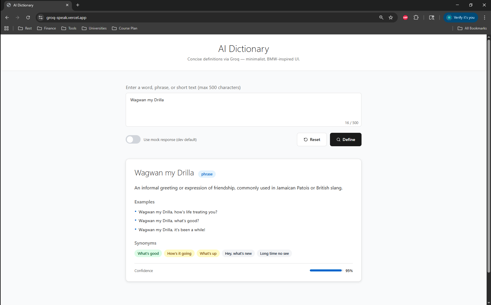

# AI Dictionary 🚀

A modern, AI-powered dictionary application with a minimalist BMW-inspired UI, powered by Groq LLM. Get instant, comprehensive definitions for any word, phrase, or concept.



## ✨ Live Demo

**🌐 Hosted at**: [https://groq-speak.vercel.app](https://groq-speak.vercel.app)  

## 🎯 Features

- **AI-Powered Definitions**: Get comprehensive definitions using Groq's advanced language models
- **Smart Examples**: Contextual usage examples for better understanding
- **Synonym Suggestions**: Discover related words with similarity levels
- **Mock Mode**: Development-friendly mock responses for testing
- **Responsive Design**: Beautiful, minimalist BMW-inspired UI
- **Real-time Search**: Instant results with loading states
- **Error Handling**: Graceful error management and user feedback

## 🛠️ Tech Stack

### Frontend
- **React 18** + **TypeScript** - Modern, type-safe UI development
- **Vite** - Lightning-fast build tool and dev server
- **Tailwind CSS** - Utility-first CSS framework
- **Axios** - HTTP client for API communication
- **Lucide React** - Beautiful, customizable icons

### Backend
- **FastAPI** - Modern, fast web framework for building APIs
- **Pydantic** - Data validation using Python type annotations
- **Groq** - High-performance LLM inference platform
- **Uvicorn** - Lightning-fast ASGI server

### Deployment
- **Frontend**: Vercel (optimized for React applications)
- **Backend**: Render (robust Python hosting)

## 🚀 Quick Start

### Prerequisites
- Node.js 16+ & Python 3.11+
- Groq API key (optional - works with mock mode)

### Local Development

1. **Clone the repository**
   ```bash
   git clone <your-repo-url>
   cd Dict_app_2
   ```

2. **Backend Setup**
   ```bash
   # Install dependencies
   pip install uv
   uv sync
   
   # Configure API key (optional)
   python setup_env.py
   
   # Start backend server
   uv run backend/main.py
   ```

3. **Frontend Setup**
   ```bash
   cd frontend
   npm install
   npm run dev
   ```

4. **Access the application**
   - Frontend: `http://localhost:5173`
   - Backend API: `http://localhost:8000`
   - API Docs: `http://localhost:8000/docs`

## 🌐 Deployment

This application is deployed using a **hybrid approach** for optimal performance:

### Frontend (Vercel)
- **URL**: https://groq-speak.vercel.app
- **Framework**: Vite + React
- **Build Command**: `npm run build`
- **Environment Variables**: `VITE_API_URL` pointing to backend

### Backend (Render)
- **Runtime**: Python 3.11
- **Build Command**: `pip install uv && uv sync`
- **Start Command**: `uv run uvicorn backend.main:app --host 0.0.0.0 --port $PORT`
- **Environment Variables**: `GROQ_API_KEY` for Groq API access

> **Note**: Replace placeholder URLs with your actual deployment URLs when setting up your own instance.

## Usage

1. **Enter Text**: Type any word, phrase, or concept (max 500 characters)
2. **Get Results**: Receive comprehensive definitions with examples and synonyms

## Security

- **CORS Configuration**: Properly configured for cross-origin requests
- **Input Validation**: Server-side validation with Pydantic